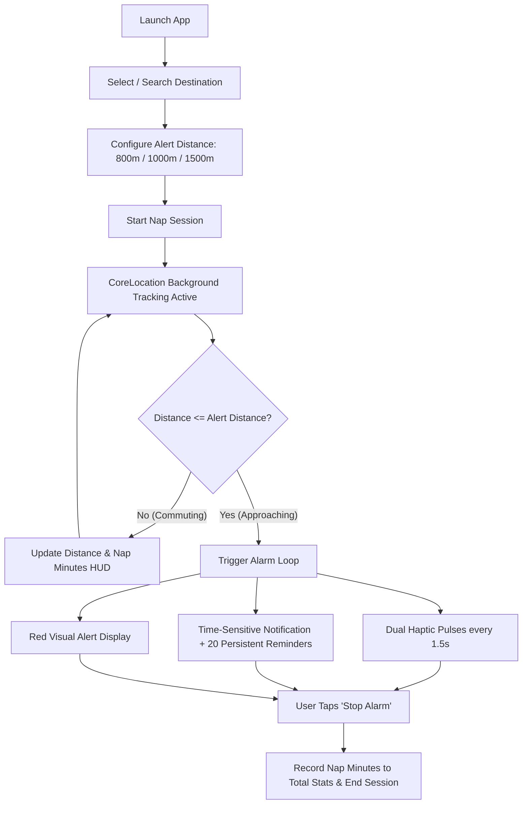

# Orio (watchOS) 🚊😴

> **Smart, location-aware transit nap alarm for Apple Watch.** Never miss your stop again.

[](https://developer.apple.com/watchos/)
[](https://swift.org/)
[](https://developer.apple.com/xcode/)
[](https://developer.apple.com/documentation/watchkit)
[](LICENSE)

---

## 📖 Overview

**Orio** is a standalone watchOS application designed for commuters who want to rest or nap peacefully on trains, subways, and buses without the fear of oversleeping and missing their station.

Traditional time-based alarms fall short on public transit because of unpredictable delays, signal stops, and timetable changes. Orio uses **real-time GPS geofencing and proximity tracking directly on your Apple Watch**, triggering escalating haptic patterns and persistent time-sensitive alerts the moment you approach your destination.

---

## ✨ Key Features

- ⌚ **100% Standalone Watch App**: Built with `WKWatchOnly: true`. Operates independently on your Apple Watch—no companion iPhone app required.
- 📍 **Proximity-Based Geofencing**: Alerts you based on physical distance to your station, not elapsed time.
- 🎚️ **Customizable Alert Distances**: Choose when to be woken up:
  - `500 m` (compact subway/bus stops)
  - `800 m` (approx. 1–2 minutes before arrival)
  - `1,000 m` (1 km)
  - `1,500 m` (1.5 km)
  - `2,000 m` (2 km for high-speed transit)
- 🚊 **Transport Modes**: Tailor your trip with dedicated modes:
  - 🚆 **Train** (`tram.fill`)
  - 🚇 **Subway** (`tram.tunnel.fill`)
  - 🚌 **Bus** (`bus.fill`)
- 🔔 **Multi-Stage Wakeup System**:
  - **Repeating Dual Haptics**: Alternates `.notification` and `.failure` haptic taps every 1.5 seconds to reliably wake heavy sleepers.
  - **Immediate Time-Sensitive Notification**: Bypasses standard Do Not Disturb / Focus modes with `interruptionLevel = .timeSensitive`.
  - **Interactive Notification Action**: Dismiss the alarm with an actionable "Stop Alarm" button directly on the watch notification lock screen.
  - **Persistent Escalation Queue**: Pre-schedules 20 follow-up alert notifications spaced 10 seconds apart to prevent falling back asleep.
  - **High-Contrast Visual Warning**: Active display turns deep red with a prominent "WAKE UP" banner.
- 🔍 **Station & Location Search**: Integrated with Apple MapKit (`MKLocalSearch`) with 300ms debounce for instant search across train stations, transit hubs, and custom addresses.
- ⚡ **Smart Station Suggestions**:
  - **Nearby Stations**: Automatically calculates geodesic distances to major transit stations and displays the closest stops.
  - **Favorites & Most Used**: Star any station directly from the dashboard, trip setup, or context menu for instant 1-tap starts.
  - **Recent History**: Remembers your recent stops with automatic LRU eviction and swipe/context menu deletion.
- 🗺️ **Interactive Map Integration**:
  - **Pre-trip Map Preview**: Visualizes your destination pin alongside your current location with custom zoom controls and safe boundary clamping.
  - **Live Dynamic Snapshot**: Background `MKMapSnapshotter` renders an ambient route overview on the active nap HUD.
- ⏱️ **Commute & Nap Analytics**:
  - Live elapsed nap duration counter during active sessions.
  - Cumulative lifetime nap time counter (`totalNapMinutes`) tracked on the home screen with hold-to-reset support.
- 🛠️ **Developer Friendly**: Includes a built-in `#if DEBUG` **Demo Alert** button to test the haptic and alarm pipeline without leaving your desk.

---

## 🏗️ Architecture & Codebase Structure

The project is written in modern **SwiftUI** and conforms to Apple's latest watchOS conventions:

```
napsafe-watch/
├── project.yml                     # XcodeGen project specification
├── Orio.xcodeproj                  # Generated Xcode project
├── Resources/
│   ├── Info.plist                  # Background location modes & descriptions
│   ├── Orio.entitlements           # Location push & Map entitlements
│   └── Assets.xcassets             # App icons & color assets
└── Sources/
    ├── OrioApp.swift               # App entry point & service coordination
    ├── Models/
    │   ├── Destination.swift       # Destination entity & coordinate Codable support
    │   └── Session.swift           # NapSession model & TransportMode enum
    ├── Services/
    │   ├── DestinationStore.swift  # Persistence (UserDefaults), Favorites & Station catalog
    │   ├── LocationManager.swift   # CoreLocation wrapper, background tracking & distance calculation
    │   └── SessionManager.swift    # Session lifecycle, repeating haptics & notification scheduling
    ├── Utilities/
    │   └── DistanceFormatter.swift # Unified distance formatting extension (Double/CLLocationDistance)
    └── Views/
        ├── ContentView.swift       # Main hub (Nearby, Favorites, Recents, Stats)
        ├── ActiveSessionView.swift # Live nap tracking HUD with map backdrop & wake-up alerts
        ├── AlertSettingsView.swift # Distance/Transport picker, Favorite toggle & session launcher
        ├── LocationSearchView.swift# MapKit natural language search sheet with debounce
        └── MapPreviewView.swift    # SwiftUI Map preview with custom zoom controls
```

### Key Components

| Component | Responsibility |
|---|---|
| [`LocationManager`](Sources/Services/LocationManager.swift) | Configures `CLLocationManager` with `allowsBackgroundLocationUpdates = true` and `kCLLocationAccuracyBest`. Calculates real-time distance and fires proximity alerts even while the watch screen is asleep. |
| [`SessionManager`](Sources/Services/SessionManager.swift) | Orchestrates the alarm sequence, manages repeating `WKInterfaceDevice` haptics, handles interactive `UNNotificationCategory` responses, and tallies cumulative nap minutes. |
| [`DestinationStore`](Sources/Services/DestinationStore.swift) | Persists user destinations in `UserDefaults`, manages favorites and recents, and calculates nearby presets from static pre-configured transit coordinates. |
| [`DistanceFormatter`](Sources/Utilities/DistanceFormatter.swift) | Single source of truth for formatting distance measurements (`m` and `km`) across the application. |
| [`ActiveSessionView`](Sources/Views/ActiveSessionView.swift) | Renders the primary tracking screen, binds directly to `locationManager.distanceToDestination`, and displays ambient map snapshots via `MKMapSnapshotter`. |

---

## 🔄 How It Works



---

## 📱 User Flow & Screens

1. **Dashboard (`ContentView`)**:
   - Total recorded nap time header.
   - Quick-select list of nearby stations based on your current location.
   - Pinned favorites, most-used stops, and recent history.
   - Quick search button for any transit stop or address.
2. **Search (`LocationSearchView`)**:
   - Real-time search powered by Apple's `MKLocalSearch`.
   - Displays station/place name with formatted district/locality subtitles.
3. **Trip Setup (`AlertSettingsView`)**:
   - Select wakeup distance: `800m`, `1 km`, or `1.5 km`.
   - Choose transport type: Train, Subway, or Bus.
   - Preview stop on interactive map before starting.
4. **Map Preview (`MapPreviewView`)**:
   - Shows user location and target destination marker.
   - Includes custom circular zoom in (`+`) and zoom out (`-`) touch controls.
5. **Active Nap HUD (`ActiveSessionView`)**:
   - Shows remaining distance in large, bold numbers.
   - Displays live nap duration ("Napping for X min").
   - Darkened ambient route map snapshot in the background.
   - Single-tap cancel button.
6. **Alarm Screen**:
   - Screen flashes bright red with a high-contrast "WAKE UP" title.
   - Repeating haptic vibration on wrist.
   - Large "Stop Alarm" button to dismiss.

---

## 🚀 Getting Started

### Prerequisites

- **Mac** running macOS Sonoma or later
- **Xcode 16.0+**
- **watchOS 10.0+** SDK
- [XcodeGen](https://github.com/yonaskolb/XcodeGen) (optional, if generating `.xcodeproj` from scratch)

### Build & Run

#### Option A: Open the Xcode Project directly

1. Clone this repository:
   ```bash
   git clone https://github.com/masapong/napsafe-watch.git
   cd napsafe-watch
   ```
2. Open `Orio.xcodeproj` in Xcode:
   ```bash
   open Orio.xcodeproj
   ```
3. Select the `Orio` scheme and an **Apple Watch Series 9 / Ultra 2 Simulator** (or physical Apple Watch).
4. Press `Cmd + R` to build and run.

#### Option B: Regenerate with XcodeGen

If you prefer generating project files declaratively:

```bash
# Install XcodeGen if you haven't already
brew install xcodegen

# Generate project from project.yml
xcodegen generate

# Open generated project
open Orio.xcodeproj
```

---

## 🧪 Testing & Simulation

Because Orio relies on GPS motion, you can test it on the simulator or at your desk:

### 1. Built-in Demo Alert (Debug Mode)
When running a `DEBUG` build, starting any nap session reveals an orange **Demo Alert** button. Tapping it immediately fires the full wake-up sequence (haptic vibrations, notifications, and alert screen).

### 2. Xcode Location Simulation
To test the automatic geofence trigger:
1. Start a nap session targeting **Tokyo Station** with an **800 m** alert radius.
2. In Xcode's debug bar, click the **Simulate Location** button (location arrow icon).
3. Select a custom GPX file or simulate movement towards the destination.
4. When the simulated distance drops below 800 meters, Orio will trigger the alarm automatically.

---

## 🔒 Permissions & Entitlements

Orio requires the following permissions and capabilities configured in `Resources/Info.plist` and `Resources/Orio.entitlements`:

- **Location When In Use & Always** (`NSLocationWhenInUseUsageDescription`, `NSLocationAlwaysAndWhenInUseUsageDescription`):
  Allows background location updates while the watch display is dimmed or asleep during your commute.
- **Background Location Mode** (`UIBackgroundModes: ["location"]`):
  Enables continuous proximity monitoring without the watchOS runtime suspending the app.
- **Time-Sensitive Notifications** (`UNAuthorizationOptions: [.alert, .sound]`):
  Ensures alarm notifications pierce through transit Do Not Disturb / Sleep Focus profiles.

---

## 📄 License

This project is licensed under the [MIT License](LICENSE).
